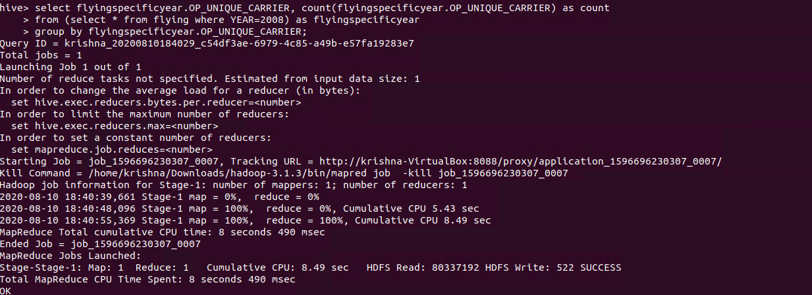
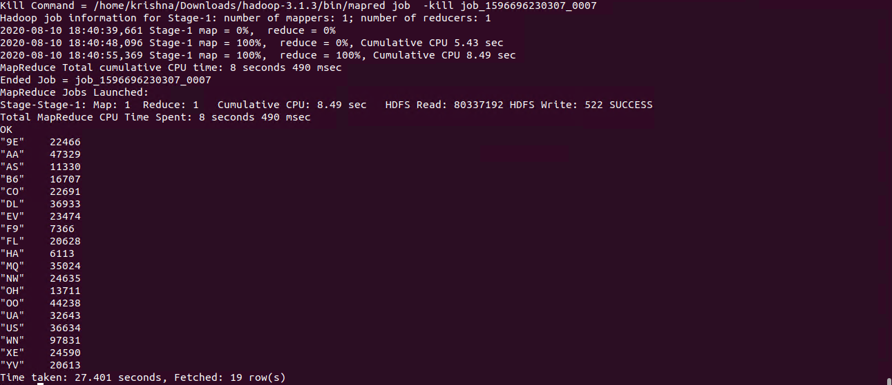
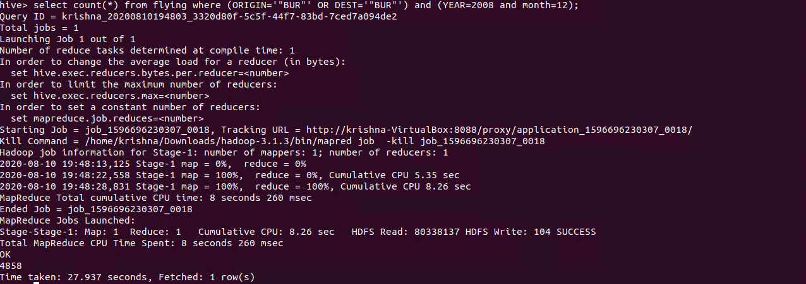
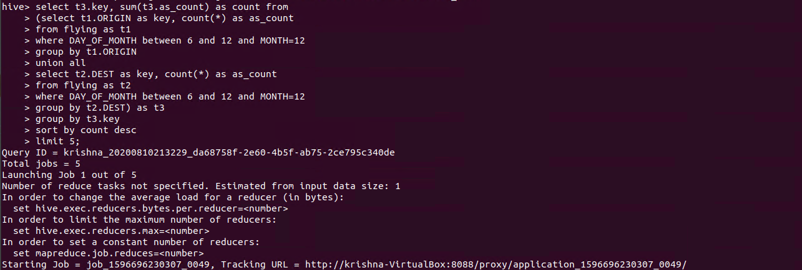
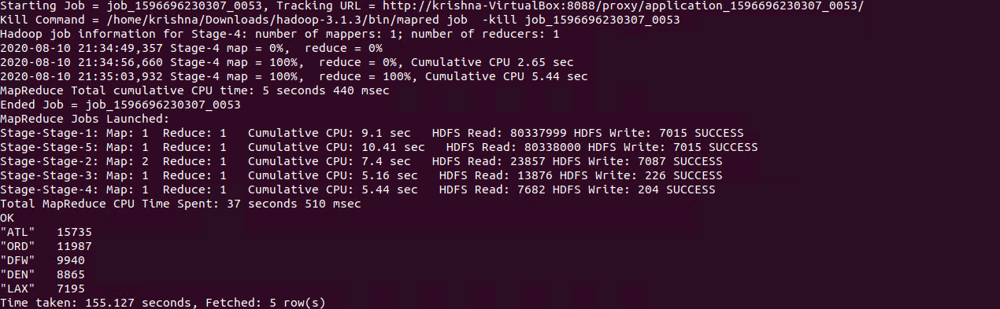
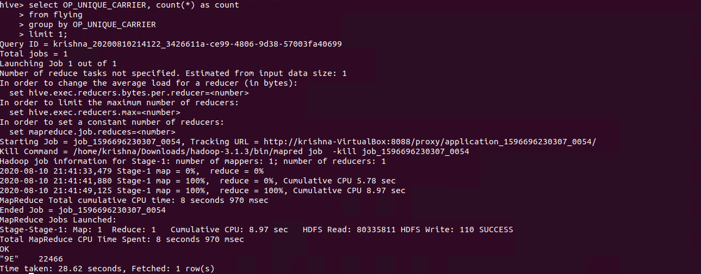

# Hive Flight Data Explore
-----------------------

### HIVE

* Hive gives a SQL-like interface to manage data. It is used in Amazon H3 file system. It also support HiveQL. Hive implicitly codeword hiveQL statement into Adirected acyclic graph of mapreduce those the spark jobs.  
* It support Advance features such as indices, partition, buckets, asummetric transactions, custom user defined functions, joins, sampling & many others. Lots of them take a considerable amount of time if implemented manually.  

### Create table in hive

  

### Create directory in Hadoop

  

### Copy file to Hadoop File System
 
  

### Load Data into table flying
 
  

### 1.	Count total number of flights per carrier in 2008 

  
  

### 2.	The total number of flights served in Dec 2008 by BUR

  

### 3.	Find five most busy airports in US during Dec 06 - Dec 12.

  
  

### 4.	Find the carrier who served the biggest number of flights.

  

**Created by:**  
**Name: Krishna Kumar Singh**  
**Email: krishnaai265@gmail.com**  
**Phone: +91-9368754996** 
